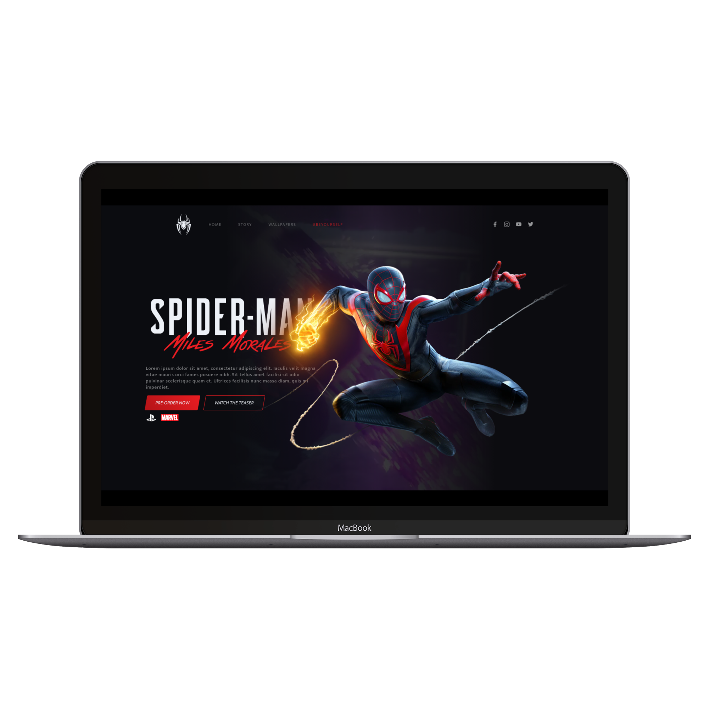

  

  

## 🚀 Tecnologias

Esse projeto foi desenvolvido com as seguintes tecnologias:

- HTML
- SASS/CSS
- JavaScript
- Vanila Tilt
- Gsap
- SVGInject

## 💻 Projeto

Homepage baseada no Jogo Spider-man: Miles Morales, criada na Front-Week do Násser Yousef Ali

## :memo: Licença

Esse projeto está sob a licença MIT. Veja o arquivo [LICENSE](LICENSE.md) para mais detalhes.
